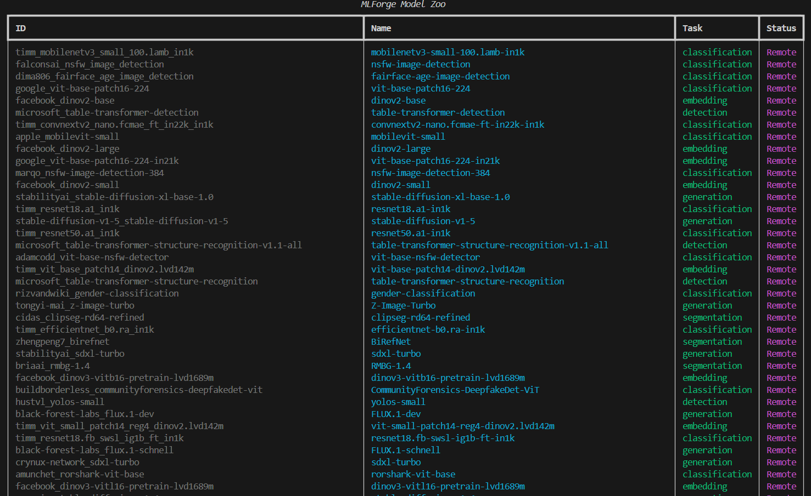

# MLForge Python SDK & CLI ⚒️

[](https://www.python.org/)
[](LICENSE)
[](https://mlforge.ai)

**The industrial-grade bridge between global AI discovery and local high-performance compute.**

MLForge provides a unified Pythonic interface to manage the full ML lifecycle—from discovering models in the global "Brain" to executing heavy training and benchmarking on your local "Muscle" hardware.

<p align="center">
  
  <br>
  <em>Explore and download from a curated zoo of 600+ industrial-grade models directly from your terminal or script.</em>
</p>

---

## 🚀 Core Capabilities

- **Unified Model Access**: One API for YOLO, Transformers, ONNX, and Timm models.
- **Local-First Datasets**: Download and analyze datasets from Hugging Face and Roboflow directly to your local NVMe storage.
- **Performance Analytics**: High-fidelity terminal dashboards for dataset health and model performance.
- **Hardware-Aware Training**: Orchestrate training runs optimized for NVIDIA CUDA or Apple Silicon.
- **Benchmarking Engine**: Automated validation across different frameworks and precisions (FP32, FP16, INT8).

---

## 📦 Installation

```bash
# Install the complete MLForge suite
pip install mlforge-sdk mlforge-cli
```

---

## 🛠️ SDK Usage (The "Brain")

Programmatically discover and interact with the global registry.

```python
from mlforge_sdk import MLForge

# Initialize the forge (Connects to Cloud Registry by default)
forge = MLForge()

# 1. Discover Models
models = forge.models.list(task="detection", framework="onnx")
print(f"Found {len(models)} detection models.")

# 2. Analyze Dataset Health (New!)
analytics = forge.datasets.get_analytics("rf-license-plate-detection")
print(f"Dataset Health Score: {analytics.healthScore}/10")
print(f"Total Quality Issues: {sum(analytics.qualityIssues.values())}")

# 3. Run Universal Inference
results = forge.inference.run(
    model_id="google/vit-base-patch16-224",
    image_path="sample.jpg"
)
```

---

## 💻 CLI Command Reference (The "Muscle")

The CLI is designed for speed and terminal productivity.

### Global Commands
| Command | Description |
| :--- | :--- |
| `mlforge start` | Launches the local FastAPI engine and the Studio UI. |
| `mlforge login` | Authenticates with the Cloud Registry (Hugging Face). |
| `mlforge system` | View real-time local hardware utilization (GPU/CPU/RAM). |

### Dataset Management
| Command | Description |
| :--- | :--- |
| `mlforge dataset list` | List locally imported and cloud-registered datasets. |
| `mlforge dataset analytics` | **(NEW)** View high-fidelity health reports in your terminal. |
| `mlforge dataset import` | Pull datasets from HF/Roboflow to local storage. |
| `mlforge dataset sync` | Sync local metadata with the cloud "Brain". |

### Model & Training
| Command | Description |
| :--- | :--- |
| `mlforge explore models` | Search the global model zoo with advanced filters. |
| `mlforge train start` | Kick off a local training job with specific hyperparams. |
| `mlforge benchmark run` | Automated performance testing on local hardware. |

---

## 🏗️ Architecture: Brain & Muscle

MLForge separates the **Control Plane** (Discovery) from the **Data Plane** (Execution).

1.  **The Brain (Cloud):** A global registry hosted on Hugging Face Spaces for metadata and discovery.
2.  **The Muscle (Local):** A high-performance FastAPI engine running on your machine for GPU-intensive tasks.

---

## 📊 Project-Based Workflow (Complete ML Lifecycle)

Create a project first, then manage all operations (training, inference, benchmarking) within that project scope:

```python
from mlforge_sdk import MLForge
import time

# Initialize
forge = MLForge(host="127.0.0.1", port=8005)

# 1. Create Project
project = forge.projects.create({"name": "detection-v2"})
print(f"Project ID: {project.id}")

# 2. Select Model & Dataset
models = forge.models.list(task="detection")
model = models[0]

datasets = forge.datasets.list(task="detection")
dataset = datasets[0]

# 3. Train
run_resp = forge.train.start({
    "project_id": project.id,
    "model_id": model.id,
    "dataset_id": dataset.id,
    "task": "detection",
    "epochs": 50,
    "batch_size": 16,
})
run_id = run_resp["run_id"]

# Monitor training
while True:
    run = forge.train.get(run_id)
    print(f"Epoch {run.epoch}/{run.total_epochs}")
    if run.status in ["completed", "failed"]:
        break
    time.sleep(5)

# 4. Run Inference
import base64
with open("test_image.jpg", "rb") as f:
    image_b64 = base64.b64encode(f.read()).decode()

result = forge.inference.run({
    "project_id": project.id,
    "model_id": model.id,
    "task": "detection",
    "image_base64": image_b64,
})
print(f"Detections: {result.get('detections')}")

# 5. Benchmark
bench_resp = forge.benchmark.run({
    "project_id": project.id,
    "model_id": model.id,
    "dataset_id": dataset.id,
    "task": "detection",
    "framework": "pytorch",
})
job_id = bench_resp["job_id"]

# Wait for benchmark
while True:
    job = forge.benchmark.get_job(job_id)
    if job.status in ["completed", "failed"]:
        break
    time.sleep(5)

result = forge.benchmark.get_result(job_id)
print(f"mAP: {result.metrics.get('mAP')}")
print(f"Latency: {result.metrics.get('latency_ms')}ms")

# 6. Export Model
export_resp = forge.exports.start({
    "project_id": project.id,
    "run_id": run_id,
    "format": "onnx",
})
export_id = export_resp["job_id"]

# Wait and download
while True:
    exp = forge.exports.get(export_id)
    if exp.status == "completed":
        break
    time.sleep(5)

export_bytes = forge.exports.download(export_id)
with open("model.onnx", "wb") as f:
    f.write(export_bytes)
```

### CLI: Train with Live Metrics

```bash
# Start training with progress bar + real-time metrics
mlforge train start \
  --project-id abc123 \
  --model-id yolov8n \
  --dataset-id rf-coco \
  --task detection \
  --epochs 100 \
  --batch-size 16 \
  --device cuda
```

### CLI: Benchmark with Terminal UI

```bash
# Run benchmark with live progress
mlforge benchmark run \
  --project-id abc123 \
  --model-id yolov8n \
  --dataset-id rf-coco \
  --framework pytorch \
  --precision fp32 \
  --batch-size 32
```

---

## 📄 License
© 2026 MLForge Team. All rights reserved. Proprietary software. For commercial licensing, contact [sales@mlforge.ai](mailto:sales@mlforge.ai).
